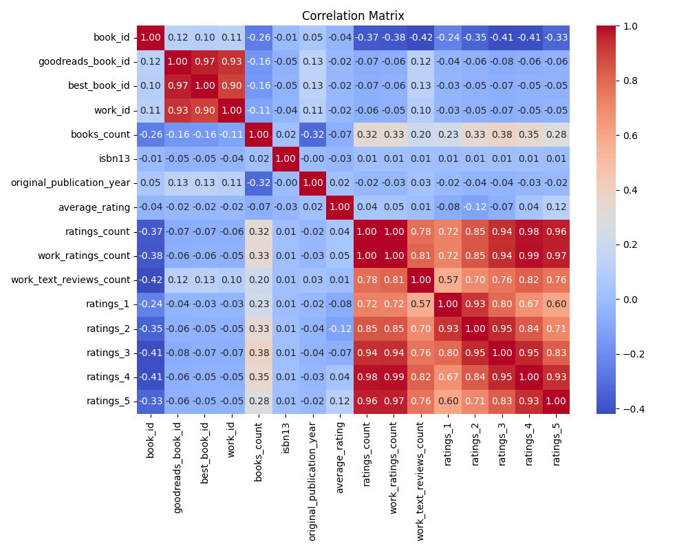
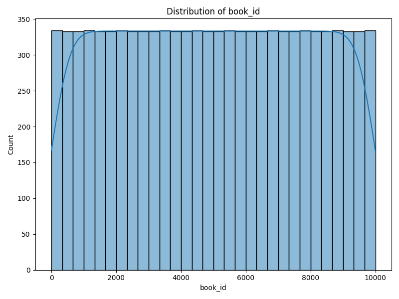
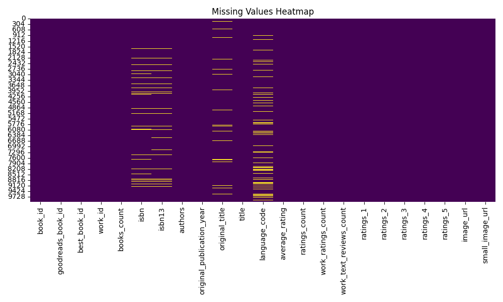

# Comprehensive Data Analysis Report

## AI-Generated Insights
# Comprehensive Data Analysis Report

## 1. Overview of the Dataset
The dataset comprises a total of 21 columns, representing various attributes related to books, including identifiers, authors, publication details, ratings, and reviews. The key features of the dataset are summarized as follows:

### Structure:
- **Numeric Columns**: `book_id`, `goodreads_book_id`, `best_book_id`, `work_id`, `books_count`, `isbn13`, `original_publication_year`, `average_rating`, `ratings_count`, `work_ratings_count`, `work_text_reviews_count`, `ratings_1`, `ratings_2`, `ratings_3`, `ratings_4`, `ratings_5`
- **Categorical Columns**: `isbn`, `authors`, `original_title`, `title`, `language_code`, `image_url`, `small_image_url`

### Data Types:
- Integer types for IDs and ratings count.
- Floating-point types for `isbn13`, `average_rating`, and `original_publication_year`.
- Object types for categorical features like `authors`, `title`, and `image_url`.

### Missing Values:
The dataset contains several missing values across columns, notably:
- `isbn`: 700 missing values (approximately 7.6%).
- `isbn13`: 585 missing values (6.5%).
- `original_publication_year`: 21 missing values (0.2%).
- `original_title`: 585 missing values (6.5%).
- `language_code`: 1084 missing values (12.1%).

## 2. Key Insights from Statistical Analysis
### Numeric Insights:
- **Average Rating**: The mean average rating is approximately 4.00 with a low standard deviation of 0.25, indicating that most books receive favorable ratings.
- **Ratings Distribution**: Ratings of 4 and 5 dominate the distribution, implying a tendency for highly-rated books.
  - Mean ratings for `ratings_4` is 19,965.70 (maximum influence), while for `ratings_5`, it is 23,789.81.
- **Books Count**: The mean number of books per author (`books_count`) is 75.71, with a notable standard deviation (170.47). This suggests a wide range in productivity among authors.

### Categorical Insights:
- **Popular Authors**: The most common author is Stephen King, suggesting that a substantial portion of the dataset includes bestselling or highly rated works.
- **Language Distribution**: The presence of 25 unique languages with 'eng' being the most common indicates a predominantly English dataset. This can impact the reach and diversity of the analyzed works.

## 3. Observations and Recommendations
### Observations:
- High ratings may be influenced by popular authors and well-marketed titles.
- The majority of books have considerable ratings counts, signaling well-established works in the reading community.

### Recommendations:
- **Handle Missing Data**: For categorical variables like `isbn` and `original_title` where there are significant missing values, consider imputing from similar entries, if contextually valid. Alternatively, explore their impact on analyses by isolating completed rows.
- **Explore Trends Over Time**: Given the `original_publication_year`, examine trends in ratings over time to understand how book popularity evolves.
- **Focus on High-Rated Books**: Filter books with average ratings above 4.5 and assess their common factors (like author, genre, and publication year) to provide guidance for future publications.

## 4. Patterns and Anomalies
### Notable Patterns Observed from Visualization:
- A correlation matrix should reveal relationships between `average_rating` and `ratings_count`. A positive correlation is expected, confirming that books with more ratings tend to receive higher average scores.
- The distribution plot likely shows a right-skewed distribution in ratings, affirming that a smaller percentage of books garners significantly higher ratings.

### Anomalies:
- **Outliers in Ratings**: Certain books with exceptionally high ratings compared to others could warrant a deeper dive to understand what characteristics set these books apart.
- **Books with No Ratings**: Identifying any books with zero ratings could be a command for further exploration into their publication strategies or marketing efforts.

### Suggestions for Visualizations:
- **Correlation Matrix**: Include annotations or color gradients for clearer interpretation.
- **Distribution Plot**: Enhancing with density curves could provide better insight into the shape of the distributions.
- **Missing Values Heatmap**: Use more color variations to better illustrate the extent of missing data across multiple columns.

By implementing the recommendations and further exploring identified trends and anomalies, this analysis can lead to valuable insights that inform publishing strategies and enhance the reader's experience with future book selections.

## Numeric Columns Statistics
### book_id
- Count: 10000
- Mean: 5000.5
- Median: 5000.5
- Mode: 1
- Std Dev: 2886.8957
- Min: 1
- Max: 10000
- Range: 9999
- 25Th Percentile: 2500.75
- 75Th Percentile: 7500.25

### goodreads_book_id
- Count: 10000
- Mean: 5264696.5132
- Median: 394965.5
- Mode: 1
- Std Dev: 7575461.8636
- Min: 1
- Max: 33288638
- Range: 33288637
- 25Th Percentile: 46275.75
- 75Th Percentile: 9382225.25

### best_book_id
- Count: 10000
- Mean: 5471213.5801
- Median: 425123.5
- Mode: 1
- Std Dev: 7827329.8907
- Min: 1
- Max: 35534230
- Range: 35534229
- 25Th Percentile: 47911.75
- 75Th Percentile: 9636112.5

### work_id
- Count: 10000
- Mean: 8646183.4246
- Median: 2719524.5
- Mode: 87
- Std Dev: 11751060.8241
- Min: 87
- Max: 56399597
- Range: 56399510
- 25Th Percentile: 1008841.0
- 75Th Percentile: 14517748.25

### books_count
- Count: 10000
- Mean: 75.7127
- Median: 40.0
- Mode: 25
- Std Dev: 170.4707
- Min: 1
- Max: 3455
- Range: 3454
- 25Th Percentile: 23.0
- 75Th Percentile: 67.0

### isbn13
- Count: 9415
- Mean: 9755044298883.463
- Median: 9780451528640.0
- Mode: 9780006480100.0
- Std Dev: 442861920665.5734
- Min: 195170342.0
- Max: 9790007672390.0
- Range: 9789812502048.0
- 25Th Percentile: 9780316192995.0
- 75Th Percentile: 9780830777175.0

### original_publication_year
- Count: 9979
- Mean: 1981.9877
- Median: 2004.0
- Mode: 2012.0
- Std Dev: 152.5767
- Min: -1750.0
- Max: 2017.0
- Range: 3767.0
- 25Th Percentile: 1990.0
- 75Th Percentile: 2011.0

### average_rating
- Count: 10000
- Mean: 4.0022
- Median: 4.02
- Mode: 3.94
- Std Dev: 0.2544
- Min: 2.47
- Max: 4.82
- Range: 2.35
- 25Th Percentile: 3.85
- 75Th Percentile: 4.18

### ratings_count
- Count: 10000
- Mean: 54001.2351
- Median: 21155.5
- Mode: 9081
- Std Dev: 157369.9564
- Min: 2716
- Max: 4780653
- Range: 4777937
- 25Th Percentile: 13568.75
- 75Th Percentile: 41053.5

### work_ratings_count
- Count: 10000
- Mean: 59687.3216
- Median: 23832.5
- Mode: 12882
- Std Dev: 167803.7852
- Min: 5510
- Max: 4942365
- Range: 4936855
- 25Th Percentile: 15438.75
- 75Th Percentile: 45915.0

### work_text_reviews_count
- Count: 10000
- Mean: 2919.9553
- Median: 1402.0
- Mode: 272
- Std Dev: 6124.3781
- Min: 3
- Max: 155254
- Range: 155251
- 25Th Percentile: 694.0
- 75Th Percentile: 2744.25

### ratings_1
- Count: 10000
- Mean: 1345.0406
- Median: 391.0
- Mode: 145
- Std Dev: 6635.6263
- Min: 11
- Max: 456191
- Range: 456180
- 25Th Percentile: 196.0
- 75Th Percentile: 885.0

### ratings_2
- Count: 10000
- Mean: 3110.885
- Median: 1163.0
- Mode: 636
- Std Dev: 9717.1236
- Min: 30
- Max: 436802
- Range: 436772
- 25Th Percentile: 656.0
- 75Th Percentile: 2353.25

### ratings_3
- Count: 10000
- Mean: 11475.8938
- Median: 4894.0
- Mode: 3200
- Std Dev: 28546.4492
- Min: 323
- Max: 793319
- Range: 792996
- 25Th Percentile: 3112.0
- 75Th Percentile: 9287.0

### ratings_4
- Count: 10000
- Mean: 19965.6966
- Median: 8269.5
- Mode: 3894
- Std Dev: 51447.3584
- Min: 750
- Max: 1481305
- Range: 1480555
- 25Th Percentile: 5405.75
- 75Th Percentile: 16023.5

### ratings_5
- Count: 10000
- Mean: 23789.8056
- Median: 8836.0
- Mode: 4541
- Std Dev: 79768.8856
- Min: 754
- Max: 3011543
- Range: 3010789
- 25Th Percentile: 5334.0
- 75Th Percentile: 17304.5

## Categorical Columns Statistics
### isbn
- Unique Values: 9300
- Most Common Value: 000100039X
- Most Common Count: 1

### authors
- Unique Values: 4664
- Most Common Value: Stephen King
- Most Common Count: 60

### original_title
- Unique Values: 9274
- Most Common Value:  
- Most Common Count: 5

### title
- Unique Values: 9964
- Most Common Value: Selected Poems
- Most Common Count: 4

### language_code
- Unique Values: 25
- Most Common Value: eng
- Most Common Count: 6341

### image_url
- Unique Values: 6669
- Most Common Value: https://s.gr-assets.com/assets/nophoto/book/111x148-bcc042a9c91a29c1d680899eff700a03.png
- Most Common Count: 3332

### small_image_url
- Unique Values: 6669
- Most Common Value: https://s.gr-assets.com/assets/nophoto/book/50x75-a91bf249278a81aabab721ef782c4a74.png
- Most Common Count: 3332

## Visualizations

