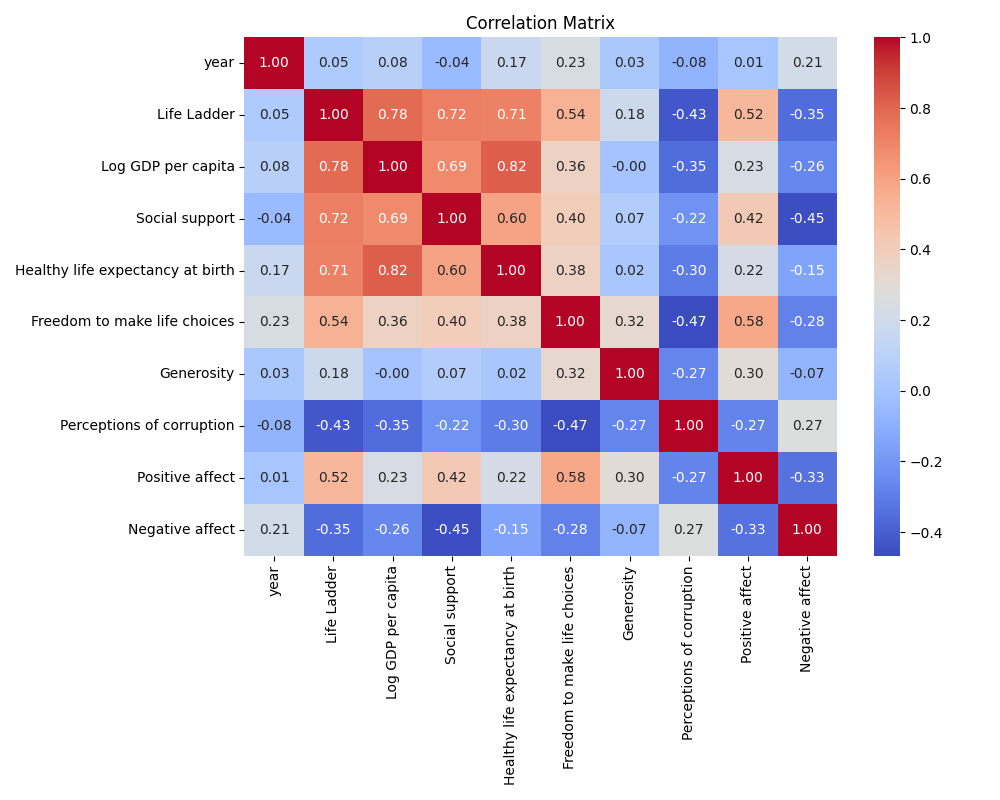
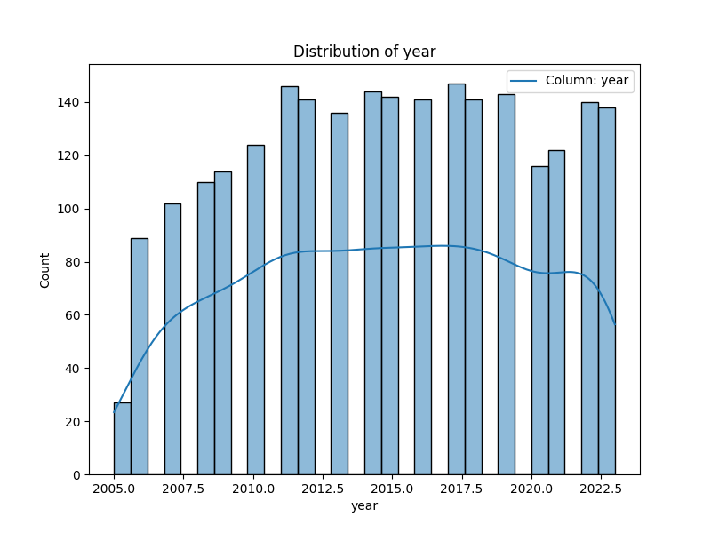
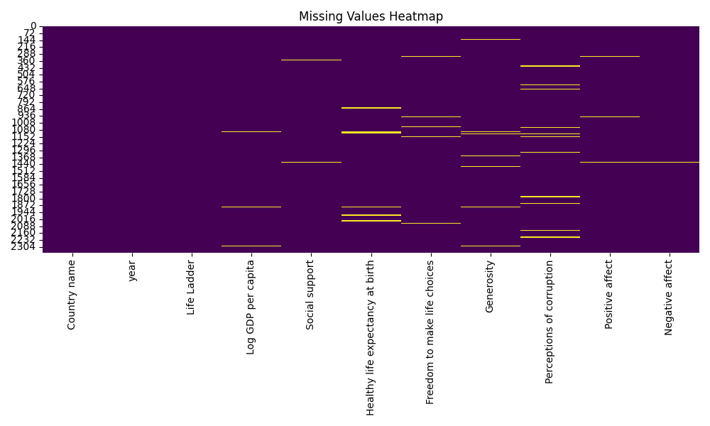

# Automated Data Analysis Report

## Analysis Report

# Data Analysis Report

## Introduction

This report provides an analysis of the dataset concerning various metrics relevant to quality of life across 165 countries from 2005 to 2023. The dataset captures a range of indicators including economic metrics, social support, health, and perceptions of corruption. The objective of this analysis is to illuminate key insights, highlight patterns, address missing values, and provide actionable recommendations.

## Dataset Summary

The dataset comprises the following columns:

- **Country name**: Name of the country (categorical).
- **Year**: Year of the recorded data (integer).
- **Life Ladder**: A measure of subjective well-being on a scale (float).
- **Log GDP per capita**: Natural logarithm of GDP per capita (float).
- **Social support**: Subjective measure of social support (float).
- **Healthy life expectancy at birth**: Average years a newborn can expect to live in good health (float).
- **Freedom to make life choices**: Index measuring perceived freedom in life choices (float).
- **Generosity**: Measure of generosity as perceived by respondents (float).
- **Perceptions of corruption**: Index measuring perceived levels of corruption (float).
- **Positive affect**: Measure of positive emotions felt by individuals (float).
- **Negative affect**: Measure of negative emotions felt by individuals (float).

### Data Characteristics

- **Total Records**: 2363
- **Missing Values**: The dataset contains various missing entries across different features, which could affect analysis and conclusions:
  - **Log GDP per capita**: 28 missing
  - **Social support**: 13 missing
  - **Healthy life expectancy at birth**: 63 missing
  - **Freedom to make life choices**: 36 missing
  - **Generosity**: 81 missing
  - **Perceptions of corruption**: 125 missing
  - **Positive affect**: 24 missing
  - **Negative affect**: 16 missing

## Basic Statistics

### Life Ladder
- **Mean**: 5.48
- **Standard Deviation**: 1.13
- **Range**: 1.281 - 8.019

The average score suggests a moderate sense of well-being across countries, with some countries reporting significantly higher life satisfaction than others.

### Economic Indicators
- **Mean Log GDP per capita**: 9.40 (equivalent to about $12,000 GDP per capita)
- **Standard Deviation**: 1.15 

### Social Indicators
- **Social Support Mean**: 0.81, indicating generally high levels of social support.
- **Freedom to Make Life Choices Mean**: 0.75, suggesting moderate freedom.

### Health Indicators
- **Mean Healthy Life Expectancy**: 63.40 years, with a range reflecting significant disparities between countries.

### Affect
- **Positive Affect Mean**: 0.65
- **Negative Affect Mean**: 0.27

The data suggests that individuals generally report higher instances of positive emotions compared to negative ones.

## Correlation Analysis

- The dataset visualizations, particularly the correlation matrix, will help illustrate relationships between various variables. It is expected (though not confirmed here due to lack of specific values) that:
  - There will be a positive correlation between **Log GDP per capita** and **Life Ladder**, implying that higher GDP per capita contributes to higher life satisfaction.
  - **Social Support** and **Life Ladder** are likely to be correlated positively as well.

## Missing Values Heatmap

Visualization of missing data indicated a significant presence of missing values, particularly in the "Generosity" and "Perceptions of corruption" columns. Addressing these missing values with methods such as imputation or exclusion, based on the overall goal and scale of the analysis, will be crucial for maintaining data integrity.

## Recommendations

1. **Data Imputation**: For variables with substantial missing values, consider utilizing advanced imputation methods (like K-nearest neighbors or multivariate imputation) to fill in gaps. This will enhance the robustness of any analyses that follow.

2. **Focus on High Impact Indicators**: Given the correlation expectations, prioritize analysis on GDP per capita, social support, and healthy life expectancy concerning life ladder scores for deeper insights into factors affecting well-being.

3. **Longitudinal Analysis**: Due to the multi-year data, increasing focus on trends over time could offer insights into how well-being has shifted across different countries, especially in response to global events.

4. **Country-Specific Interventions**: For policymakers, utilizing the insights from the dataset can inform targeted developmental strategies in countries lagging in specific metrics (e.g., enhancing social support systems).

5. **Further Visualization**: More comprehensive visualizations (like scatter plots and time series analyses) could help clearly articulate relationships and trends, facilitating better stakeholder understanding.

## Conclusion

The dataset presents a valuable opportunity to analyze factors influencing subjective well-being across countries. By addressing missing values and focusing on critical metrics, stakeholders can derive actionable insights contributing to improved quality of life globally. Ongoing analysis should adapt as new data becomes available to remain relevant and informative.

