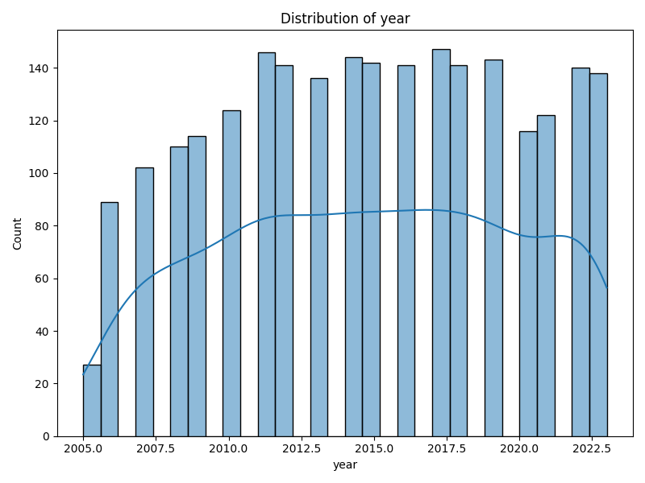

# Comprehensive Data Analysis Report

## AI-Generated Insights
### Comprehensive Data Analysis Report

#### 1. Overview of the Dataset
This dataset contains a range of socio-economic indicators and subjective well-being measures from various countries over different years. The key columns of interest are:

- **Country Name:** Represents the name of each country.
- **Year:** Represents the year of the data record.
- **Life Ladder:** A subjective measure of well-being.
- **Log GDP per capita:** A log-transformed measure of economic activity per capita.
- **Social Support:** Indicates the level of perceived support from social networks.
- **Healthy Life Expectancy at Birth:** Average number of years a newborn is expected to live in good health.
- **Freedom to Make Life Choices:** A recognized measure of personal freedom.
- **Generosity:** A measure of charitable giving and altruism.
- **Perceptions of Corruption:** An indicator of the public perception of corruption in governance.
- **Positive Affect:** A measure of the presence of positive experiences.
- **Negative Affect:** A measure of the presence of negative experiences.

#### Data Quality:
- **Missing Values:** There are significant missing data points in various columns; Generosity has the most substantial gaps (81 missing values), along with perceptions of corruption (125 missing values). This may warrant special attention during analysis and interpretation.

#### 2. Key Insights from Statistical Analysis

- **Year Analysis:**
  - The dataset spans across multiple years with a mean year of approximately **2014.76**. A standard deviation of **5.06** suggests that the dataset likely covers countries from different points in the historical timeline, without a single predominant focus year.

- **Life Ladder:**
  - The mean **Life Ladder score** is **5.48**, with a relatively low standard deviation (**1.12**), suggesting a moderate level of well-being across the dataset analogous to a reasonably consistent distribution of happiness or satisfaction.

- **Log GDP per capita:**
  - With a mean of **9.40** and a standard deviation of **1.15**, there is a varied range of economic stability across countries in the dataset.

- **Social Support:**
  - A mean of **0.81** and standard deviation of **0.12** indicates that while social support is generally perceived positively, there is diversity, potentially indicating unequal distributions across different geographical locations.

- **Healthy Life Expectancy:**
  - The mean is recorded at **63.4 years**, which may reflect varying health outcomes for different populations, necessitating further investigation to correlate health policies and socioeconomic factors.

- **Freedom and Generosity:**
  - Freedom to make life choices has a mean around **0.75**, denoting relatively good freedom perceived by individuals.
  - The Generosity metric being so close to zero indicates potentially low levels of giving or charitable actions within the recorded countries.

- **Corruption Perceptions:**
  - With a mean score of **0.74**, corruption perception indicates a generally negative view of governance alongside significant diversity (standard deviation = 0.18).

- **Affect Analysis:**
  - Higher positive affect (mean = **0.65**) contrasted with negative affect (mean = **0.27**) indicates a more prevalent feeling of happiness compared to negative emotions within the surveyed populations.

#### 3. Potential Recommendations or Observations
- **Further Data Imputation:** Consider methods to handle missing data—especially in crucial metrics such as Generosity and Perceptions of Corruption. Approaches could include mean/mode imputation or using predictive models for filling in these gaps.
  
- **Socioeconomic Focus Areas:** Investigating the relationships between life satisfaction (Life Ladder) and economic indicators (Log GDP per capita, Healthy life expectancy) can help identify effective policies.

- **Comparative Insights:** Countries scoring low in Generosity and Perceptions of Corruption might benefit from initiatives aimed at enhancing civic engagement and transparency, fostering greater community support.

- **Attention to Health Outcomes:** Countries with significantly lower Healthy Life Expectancy scores may require focused health interventions and resource allocation.

#### 4. Notable Patterns or Anomalies
- **Generosity and Corruption:** The significant missing values in the Generosity column may correspond with elevated perceptions of corruption, suggesting countries with high corruption levels potentially exhibit lower charitable behaviors.
  
- **Geographical Patterns:** Exploring correlations between geographic regions and socio-economic outcomes could reveal notable trends—hypothetically, wealthier countries may exhibit higher Life Ladder scores and Social Support levels.

- **Temporal Trends:** Analyzing trends over the years can offer insights into how global events, economic crises, or health pandemics have influenced subjective well-being and economic perceptions.

### Visualizations
The generated visualizations (correlation matrix, distribution plot, and missing values heatmap) will provide visual context for the relationships between various metrics, distributions of the data, and insights into the data quality concerning missing values. These visual tools will serve as

## Numeric Columns Statistics
### year
- *Count*: 2363
- *Mean*: 2014.7639
- *Median*: 2015.0
- *Mode*: 2017
- *Std Dev*: 5.0594
- *Min*: 2005
- *Max*: 2023
- *Range*: 18
- *25Th Percentile*: 2011.0
- *75Th Percentile*: 2019.0

### Life Ladder
- *Count*: 2363
- *Mean*: 5.4836
- *Median*: 5.449
- *Mode*: 5.252
- *Std Dev*: 1.1255
- *Min*: 1.281
- *Max*: 8.019
- *Range*: 6.738
- *25Th Percentile*: 4.647
- *75Th Percentile*: 6.3235

### Log GDP per capita
- *Count*: 2335
- *Mean*: 9.3997
- *Median*: 9.503
- *Mode*: 10.878
- *Std Dev*: 1.1521
- *Min*: 5.527
- *Max*: 11.676
- *Range*: 6.149
- *25Th Percentile*: 8.5065
- *75Th Percentile*: 10.3925

### Social support
- *Count*: 2350
- *Mean*: 0.8094
- *Median*: 0.8345
- *Mode*: 0.937
- *Std Dev*: 0.1212
- *Min*: 0.228
- *Max*: 0.987
- *Range*: 0.759
- *25Th Percentile*: 0.744
- *75Th Percentile*: 0.904

### Healthy life expectancy at birth
- *Count*: 2300
- *Mean*: 63.4018
- *Median*: 65.1
- *Mode*: 66.6
- *Std Dev*: 6.8426
- *Min*: 6.72
- *Max*: 74.6
- *Range*: 67.88
- *25Th Percentile*: 59.195
- *75Th Percentile*: 68.5525

### Freedom to make life choices
- *Count*: 2327
- *Mean*: 0.7503
- *Median*: 0.771
- *Mode*: 0.838
- *Std Dev*: 0.1394
- *Min*: 0.228
- *Max*: 0.985
- *Range*: 0.757
- *25Th Percentile*: 0.661
- *75Th Percentile*: 0.862

### Generosity
- *Count*: 2282
- *Mean*: 0.0001
- *Median*: -0.022
- *Mode*: 0.068
- *Std Dev*: 0.1614
- *Min*: -0.34
- *Max*: 0.7
- *Range*: 1.04
- *25Th Percentile*: -0.112
- *75Th Percentile*: 0.0938

### Perceptions of corruption
- *Count*: 2238
- *Mean*: 0.744
- *Median*: 0.7985
- *Mode*: 0.844
- *Std Dev*: 0.1849
- *Min*: 0.035
- *Max*: 0.983
- *Range*: 0.948
- *25Th Percentile*: 0.687
- *75Th Percentile*: 0.8678

### Positive affect
- *Count*: 2339
- *Mean*: 0.6519
- *Median*: 0.663
- *Mode*: 0.718
- *Std Dev*: 0.1062
- *Min*: 0.179
- *Max*: 0.884
- *Range*: 0.705
- *25Th Percentile*: 0.572
- *75Th Percentile*: 0.737

### Negative affect
- *Count*: 2347
- *Mean*: 0.2732
- *Median*: 0.262
- *Mode*: 0.206
- *Std Dev*: 0.0871
- *Min*: 0.083
- *Max*: 0.705
- *Range*: 0.622
- *25Th Percentile*: 0.209
- *75Th Percentile*: 0.326

## Categorical Columns Statistics
### Country name
- *Unique Values*: 165
- *Most Common Value*: Argentina
- *Most Common Count*: 18

## Visualizations

