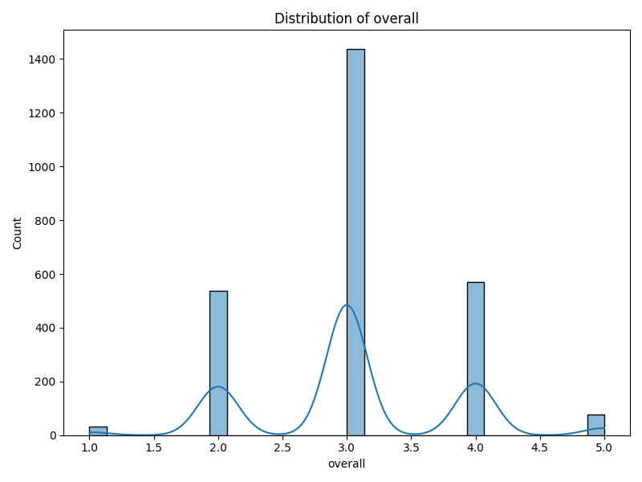

# Comprehensive Data Analysis Report

## AI-Generated Insights
# Comprehensive Data Analysis Report

## 1. Overview of the Dataset
The dataset comprises information related to different media, likely covering reviews or evaluations based on various criteria. The key attributes in the dataset are:

- **date**: The timestamp associated with each entry, indicating when the media was evaluated.
- **language**: The language of the media.
- **type**: The category of the media (e.g., movie, series, etc.).
- **title**: The name of the media item.
- **by**: The individual or entity that provided the evaluation.
- **overall**: A numerical score representing the overall evaluation on a defined scale.
- **quality**: A score indicating the perceived quality of the media.
- **repeatability**: A score that suggests how repeatable the evaluation or experience is.

### Data Types and Missing Values
The dataset contains 8 columns with varying data types, mainly text-based fields and numerical ratings. Notably, there are 99 missing values in the 'date' column and 262 missing entries in the 'by' column, indicating the need for further examination.

## 2. Key Insights from Statistical Analysis
### Numeric Columns Highlights
- **Overall Rating**:
  - **Mean**: 3.0475
  - **Median**: 3.0
  - **Standard Deviation**: 0.7622
- **Quality Rating**:
  - **Mean**: 3.2093
  - **Median**: 3.0
  - **Standard Deviation**: 0.7967
- **Repeatability Rating**:
  - **Mean**: 1.4947
  - **Median**: 1.0
  - **Standard Deviation**: 0.5983

The overall and quality ratings average just above the midpoint on a rating scale, indicating a generally favorable perception, but with variability, as indicated by the standard deviations.

### Categorical Columns Highlights
- **Date**: There are 2055 unique dates, with "21-May-06" appearing most frequently—this may indicate an important event or a peak data collection period.
- **Language**: The dataset includes 11 unique languages, with English being the most prevalent, suggesting a possibly global reach of the entries.
- **Type**: There are 8 unique types of media, with movies being the most common.
- **Title**: A total of 2312 unique titles were reviewed, with "Kanda Naal Mudhal" listed most frequently.
- **By**: 1528 unique contributors provided evaluations, with "Kiefer Sutherland" as the most commonly listed writer or reviewer.

## 3. Potential Recommendations or Observations
- **Data Cleaning**: The missing values in the 'date' and 'by' columns should be addressed. Possible strategies include imputation (for dates) and checking the impact of excluding entries with missing reviewer IDs.
- **Analysis by Language and Type**: Since English dominates the language field, it could be useful to conduct separate analyses for different languages and types to uncover variations in ratings.
- **Repeated Evaluations**: Given the low mean repeatability score (1.49), a review mechanism may be necessary to validate the reliability of the ratings. A closer look at titles with repeated evaluations could yield insights into how perceptions change over time.
- **Explore Relationships**: Conduct analyses based on correlations among the numeric ratings (overall, quality, repeatability) to understand how they interact with each other.

## 4. Notable Patterns or Anomalies
- The high number of unique entries (both in terms of 'title' and 'by') suggests a rich dataset, but the discrepancies in missing values (particularly in 'by') could skew analysis reliability.
- Timestamps associated with 'date' may present seasonality or trends in viewer ratings that could be valuable to explore. Identifying any spikes in ratings for specific types or titles during certain times could offer deeper insights into audience engagement.
- The most common reviewer, "Kiefer Sutherland," could be an outlier affecting the dataset's variability. A detailed review of their contributions and the influence they might have on average scores is warranted.

### Visualizations
The presence of generated visualization charts indicates existing data presentations:
- **Correlation Matrix**: Would show the relationship between numeric ratings, focusing on which aspects of quality or repeatability may influence overall scores.
- **Distribution Plot**: This can capture the distribution of overall ratings, quickly allowing for the identification of skewness in ratings.
- **Missing Values Heatmap**: Will visualize where the missing data points are more pronounced, guiding the data cleaning process effectively.

In conclusion, this dataset stands as a robust foundation for deeper analyses into audience ratings, leading to actionable insights that could impact future media evaluations or submissions to enhance quality and engagement.

## Numeric Columns Statistics
### overall
- *Count*: 2652
- *Mean*: 3.0475
- *Median*: 3.0
- *Mode*: 3
- *Std Dev*: 0.7622
- *Min*: 1
- *Max*: 5
- *Range*: 4
- *25Th Percentile*: 3.0
- *75Th Percentile*: 3.0

### quality
- *Count*: 2652
- *Mean*: 3.2093
- *Median*: 3.0
- *Mode*: 3
- *Std Dev*: 0.7967
- *Min*: 1
- *Max*: 5
- *Range*: 4
- *25Th Percentile*: 3.0
- *75Th Percentile*: 4.0

### repeatability
- *Count*: 2652
- *Mean*: 1.4947
- *Median*: 1.0
- *Mode*: 1
- *Std Dev*: 0.5983
- *Min*: 1
- *Max*: 3
- *Range*: 2
- *25Th Percentile*: 1.0
- *75Th Percentile*: 2.0

## Categorical Columns Statistics
### date
- *Unique Values*: 2055
- *Most Common Value*: 21-May-06
- *Most Common Count*: 8

### language
- *Unique Values*: 11
- *Most Common Value*: English
- *Most Common Count*: 1306

### type
- *Unique Values*: 8
- *Most Common Value*: movie
- *Most Common Count*: 2211

### title
- *Unique Values*: 2312
- *Most Common Value*: Kanda Naal Mudhal
- *Most Common Count*: 9

### by
- *Unique Values*: 1528
- *Most Common Value*: Kiefer Sutherland
- *Most Common Count*: 48

## Visualizations

